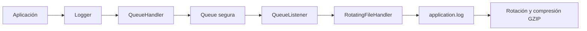

# triton_monitor

## TP-1: Sistema de Telemetría Multicloud y Observabilidad Asíncrona

Proyecto Tritón desarrollado para monitorear de forma asíncrona el estado de distintos proveedores cloud: AWS, Azure y GCP.

El sistema utiliza `asyncio` y `httpx` para realizar consultas HTTP concurrentes, implementa manejo de excepciones personalizadas y un sistema de logging no bloqueante mediante `QueueHandler` y `QueueListener`.

## Tecnologías utilizadas

- Python 3.11+
- asyncio
- httpx
- logging
- argparse

## Estructura del proyecto

```text
triton_monitor/
├── src/
│   ├── triton_telemetry/
│   │   ├── __init__.py
│   │   ├── core.py
│   │   ├── exceptions.py
│   │   ├── sanitizer.py
│   │   └── storage.py
│   └── app_operator.py
├── .gitignore
├── README.md
└── requirements.txt
```

## Instalación

Clonar el repositorio e instalar las dependencias:

```bash
pip install -r requirements.txt
```

## Ejecución

Ejemplo de ejecución en modo nominal:

```bash
python src/app_operator.py --cluster cluster-aws-east-1
```

Modo debug:

```bash
python src/app_operator.py --mode debug --timeout 1 --cluster cluster-aws-east-1
```

Modo emergency:

```bash
python src/app_operator.py --mode emergency --timeout 1 --cluster cluster-aws-east-1
```

## Logging

El sistema implementa logging no bloqueante mediante una cola segura para hilos.

El flujo de logging es el siguiente:



## Modos de operación

### Nominal

Consulta los proveedores AWS, Azure y GCP.

### Debug

Además de los proveedores principales, incorpora nodos de prueba para generar errores como timeout y respuestas HTTP inesperadas.

### Emergency

Incluye todos los nodos del modo debug y agrega un nodo que simula un fallo de red o resolución DNS.

## Manejo de excepciones

El proyecto utiliza excepciones personalizadas:

- `TritonError`
- `ProviderTimeoutError`
- `CorruptedPayloadError`
- `NetworkPeeringError`

Estas excepciones permiten clasificar y manejar los distintos errores generados durante la ejecución concurrente.

## Dependencias

El archivo `requirements.txt` contiene:

```text
httpx>=0.27.0
```


## Integrantes del proyecto

- Nombre y apellido: Santiago Ezequiel Sosa
- Nombre y apellido: Rocio Ayelen Lopez
- Nombre y apellido: Mendez Mateo Joaquin
- Nombre y apellido: Alex Cruz Vargas
- Nombre y apellido: Joel Lamas